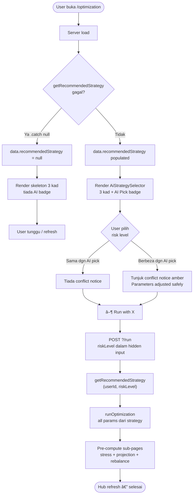
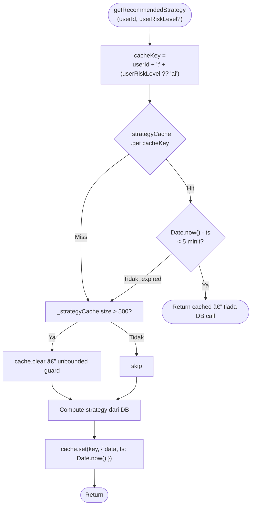
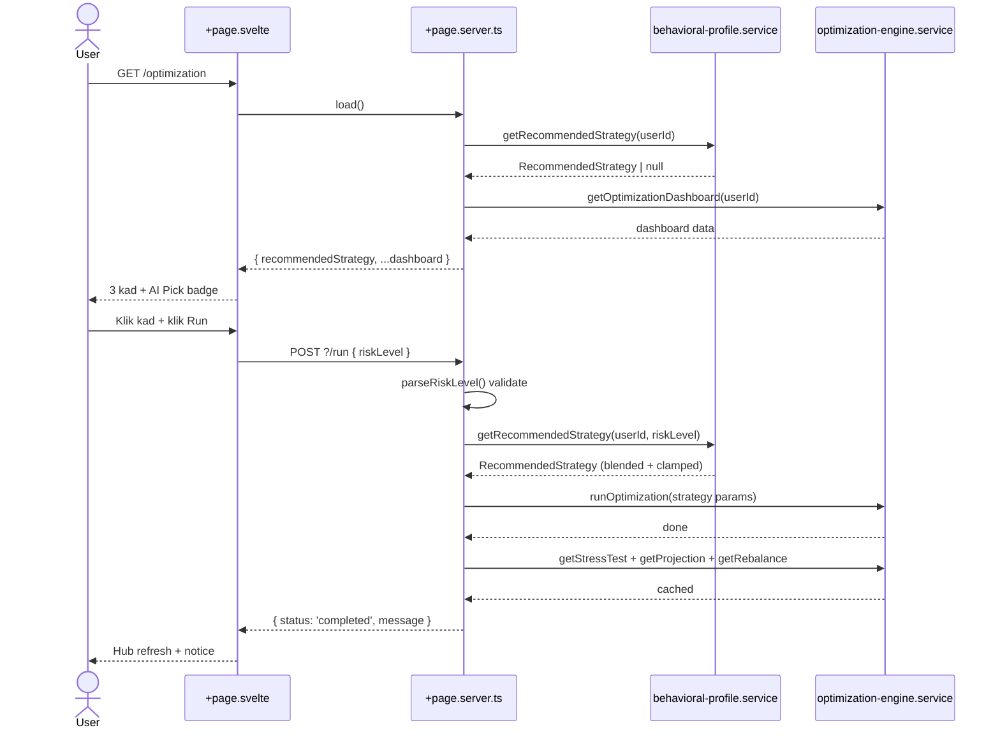
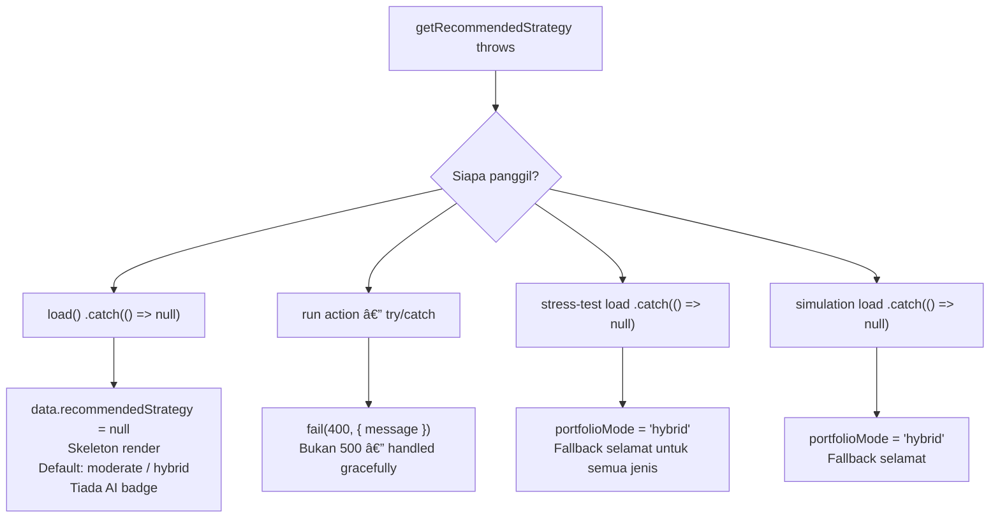

# Optimization Engine — Flowchart v2

> **Status:** Implemented 2026-05-24  
> Versi ini guna Mermaid diagrams — render dalam VS Code Markdown Preview dan GitHub.

---

## 1. User Journey — Hub ke Run



---

## 2. `getRecommendedStrategy()` — Decision Tree

```mermaid
flowchart TD
    A(["getRecommendedStrategy\n(userId, userRiskLevel?)"]) --> B{"Cache hit\n& belum expired?"}
    B -- Ya --> C([Return cached data])
    B -- Tidak --> D[getBehavioralProfile userId]
    D --> E{dataPoints === 0?}
    E -- Ya --> F([Return DEFAULT_STRATEGY clone\nmoderate + hybrid + 0% confidence])
    E -- Tidak --> G["mapActualToRiskLevel\n(profile.actualProfile) → aiRiskLevel"]
    G --> H{userRiskLevel\nada?}
    H -- Tidak --> I[effectiveRisk = aiRiskLevel]
    H -- Ya --> J[effectiveRisk = userRiskLevel]
    I --> K[Clamp cashFloorPct\ndalam RISK_CLAMPS\[effectiveRisk\]]
    J --> K
    K --> L["blendScenarioWeights\n60% behavioral + 40% base"]
    L --> M[Set optimizationGoal\nberdasarkan effectiveRisk]
    M --> N{userRiskLevel\n!== aiRiskLevel?}
    N -- Ya --> O[conflictDetected = true]
    N -- Tidak --> P[conflictDetected = false]
    O --> Q[Simpan cache → return]
    P --> Q
```

---

## 3. Scenario Weights Blending

```mermaid
flowchart LR
    A["Behavioral weights\n(dari DB)"] -- 60% --> C[Blended weights]
    B["Base weights\n(per risk level)"] -- 40% --> C
    C --> D["conservative = round(beh.c×0.6 + base.c×0.4)"]
    C --> E["balanced = round(beh.b×0.6 + base.b×0.4)"]
    C --> F["aggressive = 100 - c - b\n← absorb rounding error"]

    subgraph BASE["Base Weights per Risk Level"]
        H["conservative: c=70 b=25 a=5"]
        I["moderate:     c=25 b=50 a=25"]
        J["aggressive:   c=5  b=30 a=65"]
    end
```



---

## 4. riskLevel → Parameter Mapping

```mermaid
flowchart LR
    U([User pilih]) --> C[conservative]
    U --> M[moderate]
    U --> AG[aggressive]

    C --- C1[portfolioMode: stock]
    C --- C2[riskProfile: conservative]
    C --- C3["goal: minimum_volatility"]
    C --- C4["cashFloor: 8–20%"]

    M --- M1[portfolioMode: hybrid]
    M --- M2[riskProfile: balanced]
    M --- M3["goal: weights.goalDefault\n|| maximum_sharpe"]
    M --- M4["cashFloor: 4–12%"]

    AG --- A1[portfolioMode: options]
    AG --- A2[riskProfile: aggressive]
    AG --- A3["goal: maximum_return"]
    AG --- A4["cashFloor: 1–6%"]
```



---

## 5. Sub-Pages — portfolioMode Flow

```mermaid
flowchart TD
    A([User navigate ke sub-page]) --> B{Route}
    B --> ST[/stress-test]
    B --> SIM[/simulation]
    B --> OTH["/scenarios /allocation\n/projection /options\n/behavioral /history"]

    ST --> ST1["getRecommendedStrategy(userId)\n.catch → null"]
    ST1 --> ST2["portfolioMode = strategy?.portfolioMode ?? 'hybrid'"]
    ST2 --> ST3["✗ tiada mode pills\n✓ scenario count text\n✓ stat strip + charts"]

    SIM --> SIM1["getRecommendedStrategy(userId)\n.catch → null"]
    SIM1 --> SIM2["portfolioMode = strategy?.portfolioMode ?? 'hybrid'"]
    SIM2 --> SIM3["ScenarioSelector portfolioModes={[]}"]
    SIM3 --> SIM4["Mode dropdown disembunyi\nHidden input masih hantar mode"]
    SIM4 --> SIM5["CTA statik: View History →"]

    OTH --> OTH1[Tiada perubahan\ndalam fasa ini]
```

---

## 6. Cache Strategy



---

## 7. Sequence — Full Request Cycle



---

## 8. Error & Fallback Chain



---

## 9. Hub Grid Layout

```
┌──────────────────────────────────────────────────────────────────┐
│  🧠 Behavioral Profile                              [New]         │
│  grid-column: span 3  (full-width)                               │
└──────────────────────────────────────────────────────────────────┘
┌──────────────┐  ┌──────────────┐  ┌──────────────┐
│ 📊 Scenarios │  │ ⚖️ Rebalance │  │ 📈 Allocation│
└──────────────┘  └──────────────┘  └──────────────┘
┌──────────────┐  ┌──────────────┐  ┌──────────────┐
│ 🌪️ Stress   │  │ 🔮 Projection│  │ 🧪 Simulation│
└──────────────┘  └──────────────┘  └──────────────┘
┌──────────────┐  ┌──────────────┐
│ 🎯 Options  │  │ 📋 History   │
└──────────────┘  └──────────────┘

Responsive:
  ≤ 900px → 2-col, behavioral: span 2
  ≤ 600px → 1-col, behavioral: span 1
```

---

## 10. Quick Reference Tables

### RISK_CLAMPS

| riskLevel | cashFloorMin | cashFloorMax |
|---|---|---|
| conservative | 8% | 20% |
| moderate | 4% | 12% |
| aggressive | 1% | 6% |

### riskLevel → Parameters

| riskLevel | portfolioMode | riskProfile | optimizationGoal |
|---|---|---|---|
| conservative | stock | conservative | minimum_volatility |
| moderate | hybrid | balanced | weights.goalDefault \|\| maximum_sharpe |
| aggressive | options | aggressive | maximum_return |

### RecommendedStrategy Fields

| Field | Source |
|---|---|
| `riskLevel` | userRiskLevel ?? mapActualToRiskLevel(actualProfile) |
| `portfolioMode` | riskLevel mapping |
| `riskProfile` | riskLevel mapping |
| `optimizationGoal` | riskLevel + weights.goalDefault |
| `cashFloorPct` | profile.weights.cashFloorPct clamped dalam RISK_CLAMPS |
| `rebalanceTrigger` | profile.weights.rebalanceTrigger |
| `scenarioWeights` | blended 60/40 — sum = 100 |
| `confidence` | profile.confidencePct (0–100) |
| `conflictDetected` | userRiskLevel !== aiRiskLevel |
| `aiRecommendedLevel` | hasil mapActualToRiskLevel — untuk conflict notice |

### Cache Keys

| Scenario | Key format |
|---|---|
| AI recommendation (load) | `${userId}:ai` |
| User pilih conservative | `${userId}:conservative` |
| User pilih moderate | `${userId}:moderate` |
| User pilih aggressive | `${userId}:aggressive` |

---

## 11. Files Diubah

| File | Perubahan |
|---|---|
| `src/lib/services/behavioral-profile.service.ts` | Tambah `RiskLevel`, `RecommendedStrategy`, `getRecommendedStrategy()`, `RISK_CLAMPS`, `BASE_WEIGHTS`, in-memory cache |
| `src/lib/components/optimization/AiStrategySelector.svelte` | **BARU** — 3-card risk picker, AI badge, `role="radiogroup"` |
| `src/routes/optimization/+page.server.ts` | Buang `getUserPortfolioMode` + `saveMode`; load + run dari `getRecommendedStrategy` |
| `src/routes/optimization/+page.svelte` | Buang `OptimizationModeSelector`; tambah `AiStrategySelector`, skeleton, conflict notice, behavioral card full-width |
| `src/routes/optimization/stress-test/+page.server.ts` | `portfolioMode` dari behavioral; buang `PORTFOLIO_MODES` |
| `src/routes/optimization/stress-test/+page.svelte` | Buang mode pills; tambah scenario count text |
| `src/routes/optimization/simulation/+page.server.ts` | `portfolioMode` dari behavioral |
| `src/routes/optimization/simulation/+page.svelte` | `portfolioModes={[]}`, buang conditional CTA, statik History link |
| `src/lib/components/simulation/ScenarioSelector.svelte` | Mode field dalam `{#if portfolioModes.length > 0}` |

**Tidak diubah:**
- `OptimizationModeSelector.svelte` — disimpan, tidak dipadam
- `optimization-engine.service.ts` — dalaman tidak berubah
- `/scenarios`, `/projection`, `/rebalance`, `/history`, `/options`, `/allocation`, `/behavioral`
